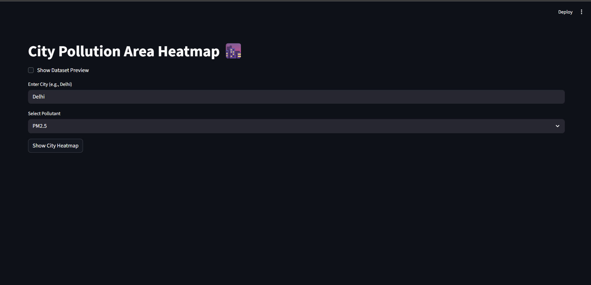

# EcoPredict
A web or desktop application that monitors, analyzes, and predicts air pollution using publicly available datasets and machine learning. Users can visualize trends, forecast future AQI, and get recommendations
# 🌍 EcoPredict – City Pollution Heatmap & Analysis  

 An interactive, modern web app for exploring, analyzing, and visualizing **Air Quality Index (AQI)** across Indian cities. ✨  

---

##  Features  

 **City-wise Heatmaps** → Visualize AQI across monitoring stations within a city  
 **Preprocessing** → Handles missing values and merges station metadata automatically  
 **Modeling (Future Ready)** → Extendable to Random Forest, Logistic Regression, or XGBoost  
 **Evaluation (Planned)** → Add confusion matrices, feature importances, and AQI prediction reports  
 **Prediction (Planned)** → Train models to predict AQI category for future dates  
 **Modern UI** → Streamlit-powered, clean, and responsive dashboard  

---

## Live Demo  

 

---

##  App Preview  

  


---

##  Quick Start  

```bash
# 1. Clone the repository
git clone https://github.com/your-username/EcoPredict.git
cd EcoPredict

# 2. Create and activate a virtual environment
python -m venv venv
venv\Scripts\activate   # On Windows
# Or
source venv/bin/activate  # On Mac/Linux

# 3. Install dependencies
pip install -r requirements.txt

# 4. Run the Streamlit app
streamlit run app.py
